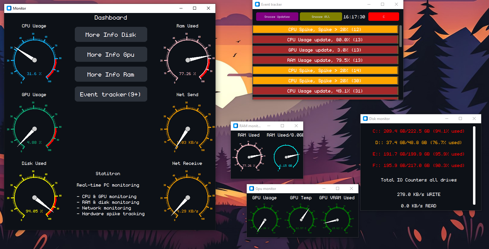

# Statitron

Statitron is a computer monitoring tool that monitors hardware usage using Python.

It monitors:

- CPU usage
- GPU usage
- RAM usage
- Disk usage
- Disk read and write
- Network receive and send
- Hardware spikes

The GPU monitoring only works with NVIDIA GPUs.

## How to try

1. Double click monogram.ttf to install the font(this step isn't mandatory but it looks better with the font)
2. [Download the exe from latest release](https://github.com/TheMathematico/Statitron1/releases/tag/v1.0.0)
3. Launch the exe

## What Problem Does It Solve?

Windows provides hardware monitoring through different tools and menus, which
can make it inconvenient to quickly check everything at once.

Statitron puts important hardware statistics into one dashboard, provides
detailed monitoring for individual components, and automatically records
hardware usage spikes so they don't have to be noticed manually.

## Python Libraries

- **GPUtil** - for monitoring the GPU
- **psutil** - for monitoring network, disk, RAM, and CPU
- **CustomTkinter** - for the GUI
- **Meter from tkdial** - for displaying stats on a meter
- **time** - for timestamps

## How It Works

Statitron uses psutil to collect CPU, RAM, disk, and network statistics.
GPUtil is used to collect NVIDIA GPU usage, temperature, and VRAM information.

The dashboard updates these values and displays them using CustomTkinter and
tkdial meters. The Event Tracker periodically checks CPU, GPU, and RAM usage
and records an event when a component increases by more than 20%.

## Dashboard

The main window is a dashboard with 6 meters and buttons to open additional menus.

The dashboard shows:

- CPU usage
- GPU usage
- RAM usage in percent
- Network receive and send

## Additional Menus

There are 4 buttons that open additional windows:

- More Info Disk
- More Info RAM
- More Info GPU
- Event Tracker

### More Info Disk

Shows how much each partition on your computer is being used in GB and percent.

It also tracks how much all disks are writing and reading in total.

### More Info RAM

Shows RAM usage in percent and GB.

### More Info GPU

Shows GPU usage in percent, GPU temperature, and VRAM usage in percent.

### Event Tracker

The Event Tracker shows updates on GPU, CPU, and RAM usage every 10 seconds.

It also detects when the GPU, CPU, or RAM has a spike of over 20%.

You are able to:

- Snooze the 10-second updates
- Snooze all events, including both updates and spikes
- Clear all events, including updates and spikes

## Why I Made This

I made Statitron to make monitoring PC hardware easier and more convenient.

Windows Task Manager provides a lot of useful information, but I wanted a dedicated,
simple dashboard where important hardware statistics could be viewed at a glance,
along with an event tracker that records hardware usage spikes.

The Event Tracker was also designed to make it easier to notice short hardware usage
spikes that might otherwise be missed.

## Notes
Net and disk display read/write speed in KB/s, MB/s. However, they are actually KiB/s and MiB/s.
It's written KB/s and MB/s for simplicity.

Also, the GPU usage on the GPU monitor and GPU usage meter(on the dashboard) will show different values, not because one of them is measuring inaccurately but
because they aren't synchronized which means they measure at different times.
I didn't consider that a problem so I didn't fix it.

This program only works on windows.
